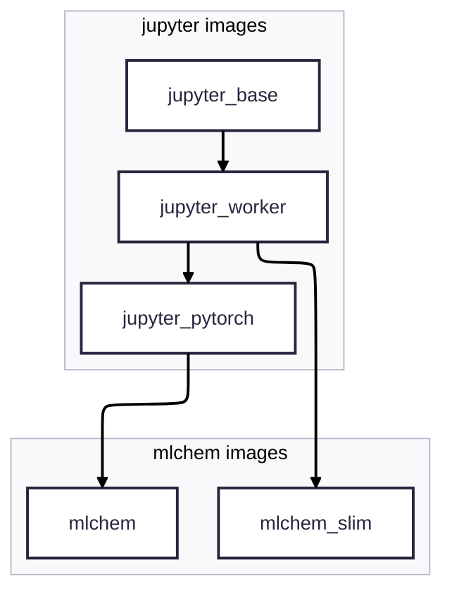

# Research Container Images Collection

This repository hosts container `Dockerfile`s for research-oriented
workflows, scientific visualization and miscellaneous tasks, aiming to provide repeatable and portable environments for daily research.

## Quick start

> [!TIP]
> Replace `podman` to `docker` as the container engine, if needed.

- Run a `jupyter` server on your personal PC
```bash
podman run -d -p 8888:8888 ghcr.io/tiangroup-uofa/mlchem:latest
```

- Run a command inside the container environment, with volume mapping
```bash
podman run -v <host_path>:<container_path> ghcr.io/tiangroup-uofa/mlchem:latest <command> [/path/inside/container]
```

- Run a command using `apptainer` on Digital Alliance HPC clusters
```bash
module load apptainer
# You need to build the image to a local .sif file before running
apptainer build <path-to-local-image>.sif docker://ghcr.io/tiangroup-uofa/mlchem:latest
apptainer run <path-to-local-image>.sif <command> [/path/on/HPC]
```

For more details please check with the [Advanced Topics]() section.

## Image specifications

### Naming Convention

All images follow the naming pattern:
```bash
ghcr.io/tiangroup-uofa/<image-name>:<tag>
```

- `<image-name>` → describes the image’s purpose (e.g. `jupyter_pytorch`, `mlchem`).
- `<tag>` → variant type. Images with accelerator support (e.g. PyTorch) provide both cpu and cuda tags when available.

You can find all available image specs in [the packages page](https://github.com/orgs/tiangroup-uofa/packages?repo_name=research-container-images)

> [!TIP]  
> If no `<tag>` is specified, it defaults to `latest` (usually CPU-only).

> [!TIP]  
> Unlike DockerHub, the `ghcr.io` prefix must be included when pulling images.

### Architectures
- All images are built for both `amd64` and `arm64`, where possible. 
- GPU-acceleration is currently only supported for `cuda` on `amd64` (i.e. no `cuda` on `arm64`).
- Some computational packages may be `amd64`-only, or the `arm64` support is not extensively tested.

### Image relationship


## Advanced Topics

### Engine selection
To use any of the images in this repository, you will need a container engine (a tool that can run containerized environments).
A variety of engines are available depending on your setup:
- On personal PC / workstation:
  - [`Podman`](https://podman.io): our recommended engine for running container images due to the [rootless feature](https://github.com/containers/podman/blob/main/docs/tutorials/rootless_tutorial.md). Available both as GUI desktop app and standalone engine.
  - [`Docker`](https://docs.docker.com/manuals/): one of the most popular engines, but may pose security issue in some cases (especially on HPC systems).
- High-Performance Computing (HPC) clusters
  - [`Apptainer`](https://apptainer.org): formerly known as `Singularity`, runs container on a local file (`.sif` format). This is the container engine used on most Digital Alliance HPC clusters in Canada.
  - [`Shifter`](https://github.com/NERSC/shifter): container engine developed by National Energy Research Scientific Computing Center (NERSC).
- General-purpose clusters
  - [`kubernetes`](https://kubernetes.io): orchestration system for managing containers across nodes in local or cloud environments (GCE, AWS)

Consult your system admin about the container usage and security
policy. Most of the examples in this README will be based on personal
PC usage via `podman` or `docker` commands.

> [!NOTE]  
> The `podman` command from the examples in this repository is interchangeable with `docker`


### Example 1: Run a jupyter server from the container
The `jupyter` series and inherited images (e.g., `mlchem`) include a built-in Jupyter server as the default command. 

On a personal PC, start a container with:
```bash
$podman run -p 8888:8888 -d ghcr.io/tiangroup-uofa/mlchem:latest
abcdefgh1234567890abcdefgh1234567890abcdefgh1234567890abcdefgh1
```
The long hash from the output (`abcdefgh...`) is the container ID we will use in subsequent commands.

The `-p 8888:8888` flag forwards the container’s port 8888 to port 8888 on your host machine (i.e. the personal PC that `podman` runs on). To get the access URL for the server in the container, use `podman logs` to check the outputs from the container, as we started it using the daemon (`-d`) mode:
```bash
$podman logs <container ID>
# Omit outputs .....
    Or copy and paste one of these URLs:
        http://localhost:8888/lab?token=abcdefgh
        http://127.0.0.1:8888/lab?token=abcdefgh
```

On your host machine, access the jupyter server by
`http://localhost:8888/lab?token=abcdefgh` as we have setup the
port-forwarding. For more setup details please refer to the [jupyter-docker-stacks documentation](https://jupyter-docker-stacks.readthedocs.io/en/latest/using/running.html).

### Example 2: Run a jupyter server with volume mount

Example 1 starts a jupyter server without persistent storage, so any
notebooks or files created inside the container will be lost when the
container is removed. To make the data persistent, you can use either a container volume storage, or mount a local directory into the container.

- Method 1: create a `podman` volume storage
```bash
# Create a named volume
podman volume create jupyter_data

# Run container with the volume
podman run -p 8888:8888 -d \
    -v jupyter_data:/home/jovyan/work \
    ghcr.io/tiangroup-uofa/mlchem:latest
```

The named volume `jupyter_data` can be reattached to another jupyter container. You can also check its content without starting a container:
```bash
# 1. Enter the Podman namespace (gives root access)
podman unshare

# 2. Mount the named volume
podman volume mount jupyter_data
# The output shows the mounted location of the volume, such as:
# /home/<your-username>/.local/share/containers/storage/volumes/jupyter_data/_data

# 3. Perform data inspection or modification, remember to preserve file permissions

# 4. When done, exit the namespace
exit
```

- Method 2: mount a local host directory (bind-mount):
```bash
podman run -p 8888:8888 -d \
    -v /path/to/local/folder:/home/jovyan/work \
    ghcr.io/tiangroup-uofa/mlchem:latest
```

Which mounts `/path/to/local/folder` on your host machine to
`/home/jovyan/work` inside the container. 

> [!TIP]
> Use `podman unshare` to modify permission of directory on the host

> [!WARNING]
> If you encounter file permission issues when using the bind-mount method, please check the [discussion in jupyter-docker-stacks](https://jupyter-docker-stacks.readthedocs.io/en/latest/using/troubleshooting.html#permission-denied-when-mounting-volumes) and understand [how user id are managed in podman](https://github.com/containers/podman/blob/main/docs/tutorials/rootless_tutorial.md).


### Example 2: use the container as jupyter kernel
One may also take advantage of multi-kernel jupyter installation, to start a notebook from a container kernel. All `mlchem` images have `ipykernel` installed to faciliate this:
```bash
# Replace mlchem --> your kernel dir name
mkdir -p ~/.local/share/jupyter/kernels/mlchem_base/
touch ~/.local/share/jupyter/kernels/mlchem_base/kernel.json
```

Edit the `kernel.json` file with following content:
```json
 "argv": [
  "podman", "run",
  "-v",
  "/home/<your-username>:/home/<your-username>",
  "-u", "0:0",
  "--network=host", "--entrypoint=",
  "ghcr.io/tiangroup-uofa/mlchem:latest",
  "/opt/conda/bin/python",
  "-Xfrozen_modules=off", 
  "-m", "ipykernel_launcher",
  "-f", "{connection_file}"
 ],
 "display_name": "mlchem container kernel",
 "language": "python",
 "metadata": {
  "debugger": true
 }
}
```

Change the `<your-username>`, image name, and display name as needed.
> [!IMPORTANT]  
> The setting `-u 0:0` changes the uid:gid that runs the
`ipykernel_launcher` *inside* the container to root:root.  
> In `podman` namespace, it is equivalent to have the same uid:gid on the host file system to avoid [permission issues](https://jupyter-docker-stacks.readthedocs.io/en/latest/using/troubleshooting.html#permission-denied-when-mounting-volumes). It is equivalent to the `docker` `-u uid:gid`.


### Run a shell command in the container
The container offers an isolated environment from the host machine to
run a command:
```bash
podman run ghcr.io/tiangroup-uofa/mlchem:latest
```


Supported Architectures • amd64 • arm64

All mlchem images are built on Ubuntu 22.04 and extend the Jupyter Docker Stacks.

⸻

Available Images
