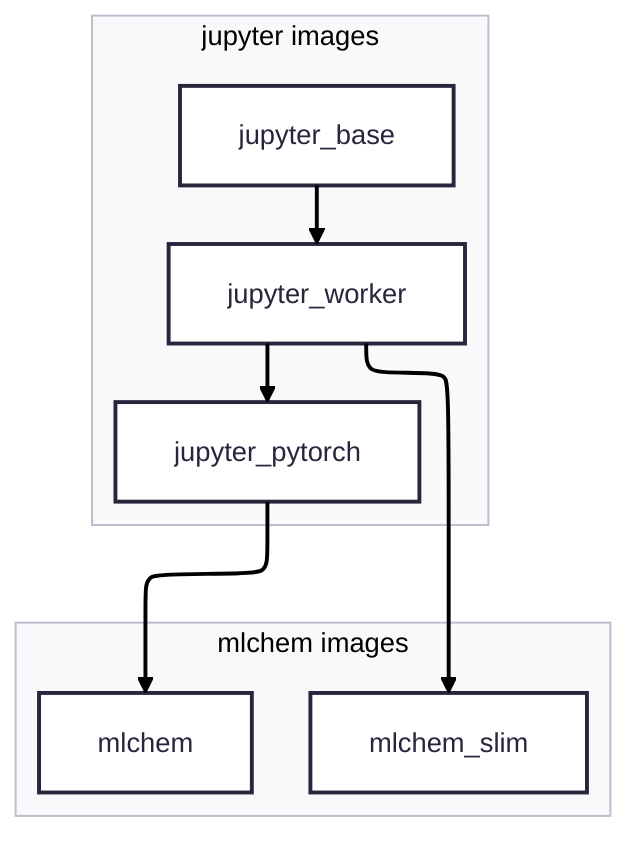

# Research Container Images Collection

This repository hosts container `Dockerfile`s for research-oriented
workflows, scientific visualization and miscellaneous tasks, aiming to provide repeatable and portable environments for daily research.

> [!NOTE]  
> Public images are hosted on the GitHub Container Registry [ghcr.io](ghcr.io).

## Quick start

> [!TIP]
> Replace `podman` to `docker` as the container engine if needed.

- Run a `jupyter` server on your personal PC
```bash
podman run -d -p 8888:8888 ghcr.io/tiangroup-uofa/mlchem:latest
```

- Run a command inside the container environment, with volume mapping
```bash
podman run -v <host_path>:<container_path> ghcr.io/tiangroup-uofa/mlchem:latest <command> [/path/inside/container]
```

- Run a command using `apptainer` on Digital Alliance HPC clusters
```bash
module load apptainer
# You need to build the image to a local .sif file before running
apptainer build <path-to-local-image>.sif docker://ghcr.io/tiangroup-uofa/mlchem:latest
apptainer run <path-to-local-image>.sif <command> [/path/on/HPC]
```

For more details please check with the [Advanced Topics]() section.

## Image specifications

### Naming Convention

All images follow the naming pattern:
```bash
ghcr.io/tiangroup-uofa/<image-name>:<tag>
```

- `<image-name>` → describes the image’s purpose (e.g. `jupyter_pytorch`, `mlchem`).
- `<tag>` → variant type. Images with accelerator support (e.g. PyTorch) provide both cpu and cuda tags when available.

You can find all available image specs in [the packages page](https://github.com/orgs/tiangroup-uofa/packages?repo_name=research-container-images)

> [!TIP]  
> If no `<tag>` is specified, it defaults to `latest` (usually CPU-only).

> [!TIP]  
> Unlike DockerHub, the `ghcr.io` prefix must be included when pulling images.

### Architectures
- All images are built for both `amd64` and `arm64`, where possible. 
- GPU-acceleration is currently only supported for `cuda` on `amd64` (i.e. no `cuda` on `arm64`).
- Some computational packages may be `amd64`-only, or the `arm64` support is not extensively tested.

### Image relationship



### Engine selection
To use any of the images in this repository, you will need a container engine (a tool that can run containerized environments).
A variety of engines are available depending on your setup:
- On personal PC / workstation:
  - [`Podman`](https://podman.io): our recommended engine for running container images due to enhanced safety. Available both as GUI desktop app and standalone engine.
  - [`Docker`](https://docs.docker.com/manuals/): one of the most popular engines, but may pose security issue in some cases.
- High-Performance Computing (HPC) clusters
  - [`Apptainer`](https://apptainer.org): formerly known as `Singularity`, runs container on a local file (`.sif` format). This is the container engine used on most Digital Alliance HPC clusters in Canada.
  - [`Shifter`](https://github.com/NERSC/shifter): container engine developed by National Energy Research Scientific Computing Center (NERSC).
- General-purpose clusters
  - [`kubernetes`](https://kubernetes.io): orchestration system for managing containers across nodes in local or cloud environments (GCE, AWS)

Consult your system admin about the container usage and security
policy. Most of the examples in this README will be based on personal
PC usage via `podman` or `docker` commands.

> [!NOTE]  
> The `podman` command from the examples in this repository is interchangeable with `docker`

### Pull the image
All available container images can be found in [the packages page](https://github.com/orgs/tiangroup-uofa/packages?repo_name=research-container-images), which use the following naming convention:


The `<image-name>` part may look like `mlchem_pytorch` and `<tag>` may accept
`cpu`, `cuda` etc. The container engine (`podman` / `docker` etc) may
choose an image suitable for the current CPU architecture
(amd64/arm64) automatically.


### Example 1: Run a jupyter server from the container
The `mlchem` series of images have built-in `jupyter` server scripts (as default command). As an example, on a personal PC, running
```bash
podman run -p 8888:8888 -d ghcr.io/tiangroup-uofa/mlchem:latest
```
will start a jupyter server daemon and accessible from `localhost:8888`. For more details please see the [jupyter-docker-stacks documentation](https://jupyter-docker-stacks.readthedocs.io/en/latest/using/running.html).

### Example 2: use the container as jupyter kernel
One may also take advantage of multi-kernel jupyter installation, to start a notebook from a container kernel. All `mlchem` images have `ipykernel` installed to faciliate this:
```bash
# Replace mlchem --> your kernel dir name
mkdir -p ~/.local/share/jupyter/kernels/mlchem_base/
touch ~/.local/share/jupyter/kernels/mlchem_base/kernel.json
```

Edit the `kernel.json` file with following content:
```json
 "argv": [
  "podman", "run",
  "-v",
  "/home/<your-username>:/home/<your-username>",
  "-u", "0:0",
  "--network=host", "--entrypoint=",
  "ghcr.io/tiangroup-uofa/mlchem:latest",
  "/opt/conda/bin/python",
  "-Xfrozen_modules=off", 
  "-m", "ipykernel_launcher",
  "-f", "{connection_file}"
 ],
 "display_name": "mlchem container kernel",
 "language": "python",
 "metadata": {
  "debugger": true
 }
}
```

Change the `<your-username>`, image name, and display name as needed.
> [!IMPORTANT]  
> The setting `-u 0:0` changes the uid:gid that runs the
`ipykernel_launcher` *inside* the container to root:root.  
> In `podman` namespace, it is equivalent to have the same uid:gid on the host file system to avoid [permission issues](https://jupyter-docker-stacks.readthedocs.io/en/latest/using/troubleshooting.html#permission-denied-when-mounting-volumes). It is equivalent to the `docker` `-u uid:gid`.


### Run a shell command in the container
The container offers an isolated environment from the host machine to
run a command:
```bash
podman run ghcr.io/tiangroup-uofa/mlchem:latest
```


Supported Architectures • amd64 • arm64

All mlchem images are built on Ubuntu 22.04 and extend the Jupyter Docker Stacks.

⸻

Available Images
