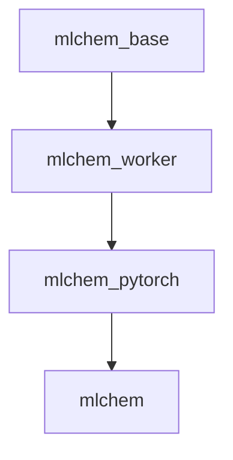

# docker-images
Collection of personal-use container images

Relations

```mermaid
flowchart TB
    A[mlchem_base]:::layer1
    B[mlchem_worker]:::layer2
    C[mlchem_pytorch]:::layer3
    D[mlchem]:::layer4

    %% Connections
    A --> B
    B --> C
    C --> D
    %%D --> E

    %% Arrange layers
    %%{rank=same; A; B}
    %%{rank=same; C; D}

    %%classDef layer1 fill=#f9f,stroke=#333,stroke-width=1px
    %%classDef layer2 fill=#bbf,stroke=#333,stroke-width=1px
```
